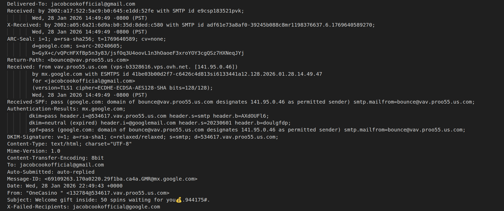
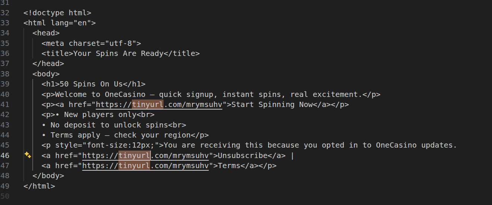
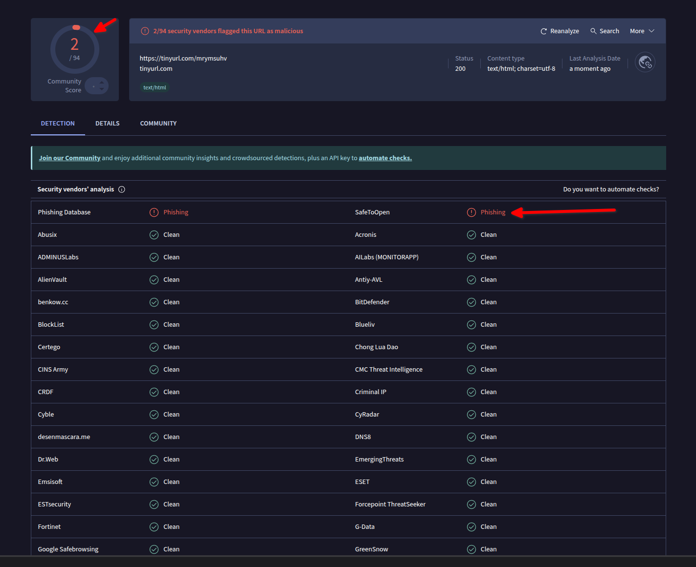
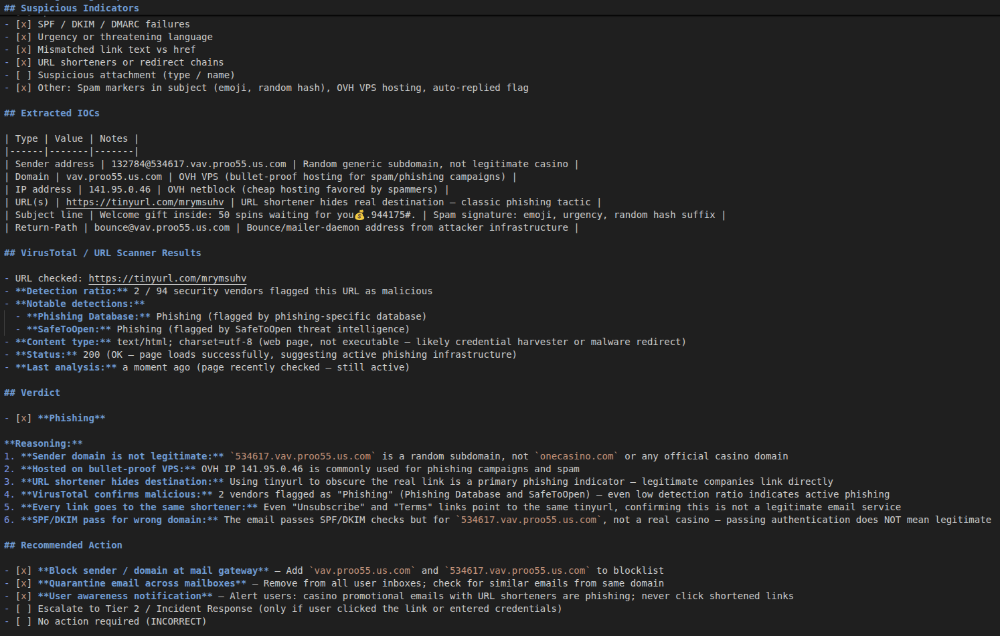

# Phishing Analysis Lab

Hands-on phishing email analysis using SOC Tier 1 techniques. Real spam samples, real header inspection, real VirusTotal lookups, structured triage reports.

## What This Lab Covers

- Parsing raw `.eml` files and mapping authentication headers (SPF, DKIM, DMARC, Received chain)
- Extracting embedded links and comparing visible text to actual `href` destinations
- Safely checking suspicious URLs against threat intelligence (VirusTotal)
- Writing structured triage reports with IOCs, verdict, and recommended response

## Repository Layout

```
samples/          .eml phishing samples (real spam, captured from Gmail)
screenshots/      Evidence screenshots from each analysis phase
reports/          Triage reports, reusable template, and triage runbook
TUTORIAL.md       Step-by-step walkthrough to reproduce this analysis
```

---

## Lab Execution & Evidence

Analysis of a real phishing/spam email impersonating "OneCasino," sent from attacker infrastructure on an OVH VPS.

### 1. Email Header Analysis

Opened the raw `.eml` in VS Code and mapped the key headers. Findings:

- **From:** `132784@534617.vav.proo55.us.com` — random subdomain, not a legitimate casino domain
- **Return-Path:** `bounce@vav.proo55.us.com` — bounce address on attacker infrastructure
- **Received:** Originated from `vps-b3328616.vps.ovh.net` (`141.95.0.46`) — OVH VPS commonly used for spam campaigns
- **SPF:** `pass` — but for `vav.proo55.us.com`, not a real business domain. Passing SPF does not mean legitimate.
- **DKIM:** `pass` for `534617.vav.proo55.us.com`; `neutral (expired)` for `googlemail.com`
- **Auto-Submitted:** `auto-replied` — bot-generated bulk mail



### 2. Link Extraction — Visible Text vs Actual Href

Extracted all `<a href="...">` tags from the HTML body. Every link in the email points to the same URL shortener:

| Visible text | Actual `href` |
|---|---|
| "Start Spinning Now" | `https://tinyurl.com/mrymsuhv` |
| "Unsubscribe" | `https://tinyurl.com/mrymsuhv` |
| "Terms" | `https://tinyurl.com/mrymsuhv` |

The "Unsubscribe" and "Terms" links going to the same destination as the CTA confirms this is not a legitimate mailing — real services have distinct unsubscribe endpoints.



### 3. VirusTotal URL Scan

Submitted `https://tinyurl.com/mrymsuhv` to VirusTotal (copy-paste, no direct click).

- **Detection ratio:** 2 / 94 security vendors flagged this URL as malicious
- **Flagged by:** Phishing Database, SafeToOpen — both categorized as **Phishing**
- **Status:** HTTP 200 (active infrastructure at time of scan)

Low detection ratio (2/94) is common for URL-shortener-based campaigns — the shortener masks the final destination, slowing down automated detection.



### 4. Triage Report

Documented all findings in a structured triage report: 6 of 7 suspicious indicators flagged, IOCs extracted (sender, domain, IP, URLs), verdict rendered as **Phishing**, recommended actions include gateway block and user awareness. Full report: [`reports/sample1-triage.md`](reports/sample1-triage.md)



---

## Tools

| Tool | Purpose |
|---|---|
| VS Code | Raw `.eml` header and HTML body inspection |
| `grep` | `href` extraction from email source |
| [VirusTotal](https://www.virustotal.com) | URL reputation and threat intelligence |
| Gmail ("Show original") | `.eml` export from live mail client |

## Skills Demonstrated

| Skill | Detail |
|---|---|
| **Email header analysis** | SPF / DKIM / DMARC interpretation, Received chain tracing, sender verification |
| **Link inspection** | Safe extraction without clicking, URL shortener identification, href vs display text comparison |
| **Threat intelligence** | VirusTotal lookups, detection ratio analysis, IOC extraction |
| **Triage reporting** | Structured one-page report with indicators, IOCs, verdict, and SOC response actions |
| **Safe handling** | No links clicked, no attachments opened, analysis performed on raw source only |

---

> "I built a lab where I analyze phishing emails: I inspect headers, trace links safely, and write triage reports so I can explain how an attack lands and how a SOC would respond."
